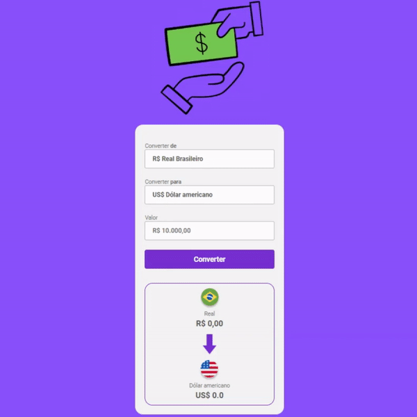

# Convert Money
Conversor de moedas com a linguagem JavaScript, HTML e CSS e usando API para obter dados atualizados.

🔗 [Acesse aqui!](https://vanvilas.github.io/convert_money/)

## Tecnologias

- HTML
- CSS
- JavaScript
- API [AwesomeAPI](https://docs.awesomeapi.com.br/api-de-moedas)
- Git e Github

